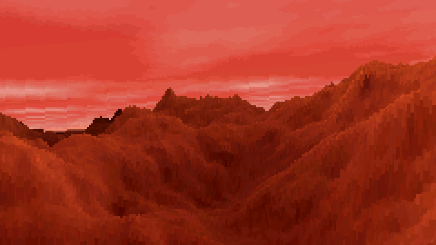
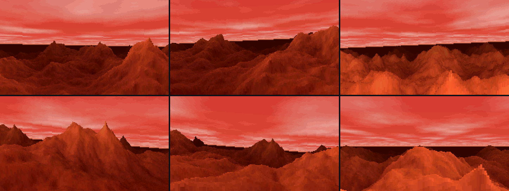

# MARS for M5StickS3 and Cardputer ADV

A port of **MARS**, Tim Clarke's legendary 1993 demo, to the
[M5StickS3](https://docs.m5stack.com/en/core/StickS3) and the
[Cardputer ADV](https://docs.m5stack.com/en/core/Cardputer-Adv): a real-time
voxel flight over a fractal red planet, steered by tilting the device (and, on
the Cardputer, with the arrow keys too).



The original MARS.EXE was a DOS program of just 5.6 KB, preserved in the
Hornet demoscene archive. It generated a landscape with a Diamond-Square
fractal and flew you over it in real time with voxel rendering, on a 386 with
VGA (320×200, 256 colours). Every run made a new planet. Its readme said:
"This code may form the basis of a forthcoming game..." It is the same
technique as in NovaLogic's Comanche.

This port does the same on the 240×135 screen of either device at 33–35
frames per second. One firmware image runs on both: it recognises the board
at start-up. The look (level horizon, salmon-red sky with pink clouds, a glowing
horizon, far mountains sinking into dark maroon) is matched to a
[capture of the original](https://www.youtube.com/watch?v=ZCUpqprm3g4).



## Controls

Hold the device in landscape, screen towards you. On both, lowering the left
or right end turns (the view banks into the turn), and tipping the top edge
away or towards you dives down to the ground or climbs.

**StickS3**, held like a tiny gamepad:

| Input | Action |
|---|---|
| KEY1 (the blue button on the front) | New planet; the current grip becomes neutral |
| KEY2 (the button on the edge) | Speed: slow, cruise, fast |
| Power button | Single press: on; double press: off |

**Cardputer ADV**:

| Input | Action |
|---|---|
| Arrow keys `,` `/` or `A` `D` | Turn left / right |
| Arrow keys `;` `.` or `W` `S` | Climb / dive |
| Enter or the G0 button | New planet; the current grip becomes neutral |
| Space | Speed: slow, cruise, fast |

The keys and the tilt work together.

The autopilot is always flying: the course wanders by itself and the height
follows the ground ahead. Tilting bends the course and the height, and
letting go hands the flight back to the autopilot.

The neutral grip is taken 0.7 s after power-on and after the screen wakes, so
any comfortable angle works. The screen goes dark after 3 minutes without a
key press or a tilt of more than 8°; a tilt or a key wakes it (that press or
tilt does nothing else). A device lying still on the table, at any angle,
lets the screen sleep.

## Installing

**M5Burner.** Choose StickS3 and look for *MARS*, or Cardputer ADV and look
for *MARS for Cardputer ADV*.

**From source**, with [PlatformIO](https://platformio.org/):

```bash
pio test -e native            # unit tests of the logic, on the computer
pio run -e sticks3 -t upload  # build and flash
pio run -e sticks3 -t merged  # single image for M5Burner (flash at 0x0)
```

The first build downloads the ESP32-S3 toolchain and takes several minutes.
PlatformIO has no board definition for the StickS3, so `platformio.ini` uses
`esp32-s3-devkitc-1` with octal PSRAM (`qio_opi`) and 8 MB partitions. The
same image boots on the Cardputer ADV, which has no PSRAM: MARS does not use
it.

If flashing fails with `Failed to connect to ESP32-S3: No serial data
received`, hold the side button until the green LED blinks and flash again.
If the screen stays dark afterwards, switch the stick off and on.

## How it works

**The planet.** A 256×256 height map is built with Diamond-Square on a torus:
every average wraps around the edges, so the map tiles seamlessly and the
flight never ends. The heights are blurred once, raised to the power 1.5
(flat plains, steep peaks) and shaded by slope with the sun on one side. The
colours come from the palette of the original, VGA `r = i/4 + 16, g = i/8,
b = i/16`. Each cell is packed as `colour << 8 | height`, so the renderer
reads both at once.

**The view.** The ground is walked from near to far in slices of growing
depth, up to 480 cells away. Each slice is a line across the map, sampled once
per screen column; the height found there is projected onto the screen and
the column is filled up to it, but only above what nearer slices have already
painted (a y-buffer). Every pixel is painted once and hills hide what is
behind them without a z-buffer. With distance the ground sinks through 16
levels into dark maroon. Banking is a shear of the horizon, as in Comanche.

**The sky.** What is left above the ground is a ceiling of fractal clouds (a
second, 128×128 Diamond-Square texture) seen in perspective, growing lighter
towards the horizon, which glows as a bright line.

**The flight.** The autopilot turns along two slow sines that never fall in
step. The height follows the highest ground up to 2.2 s ahead, rising fast
over ridges and sinking slowly into valleys, and never goes lower than 3
units above the ground.

**Speed.** A frame takes about 14 ms to draw and 13 ms to send to the display
over SPI, which gives 34–36 fps. The planet (144 KB) and the frame (65 KB)
live in internal RAM: through the PSRAM cache the random reads would be much
slower.

## Project layout

The code is split so that all the logic can be tested on a computer without
the board:

| Path | Contents |
|---|---|
| `lib/Terrain/` | Diamond-Square, the planet and its cloud texture |
| `lib/MarsPalette/` | The palette of the original; distance, sky and horizon colours |
| `lib/Camera/` | Where the camera is and where it looks |
| `lib/VoxelRenderer/` | Draws a frame into any RGB565 buffer |
| `lib/Flight/` | Autopilot, terrain following, speeds, controls |
| `lib/Tilt/` | Accelerometer readings to turn and climb; "the stick moved" |
| `lib/CardputerKeys/` | The Cardputer ADV keyboard: its controller's key events to held keys |
| `lib/DisplayTimeout/` | Idle detection for the screen timeout |
| `src/` | Board-specific code: the sprite, buttons and keyboard, IMU axes, serial commands |
| `test/` | Unity unit tests for everything in `lib/` |
| `tools/preview/` | Flies over a planet on the computer and saves a sheet of frames |
| `tools/serial_cmd.py` | Screenshots, frame rate and key presses over USB, for testing on the board |
| `tools/merged_image.py` | PlatformIO `merged` target: a single image for M5Burner |
| `mars.c` | The DOS sketch this port started from (not built) |
| `docs/` | README images and the M5Burner listing |

`lib/` is plain C++ with no Arduino or M5Unified dependencies. The `native`
environment in `platformio.ini` builds and tests it on the host.
`CLAUDE.md` has the details: design decisions, board quirks and measurements.

## Credits

- **Tim Clarke**, the author of the original MARS.EXE (1993).
- The [capture by undercat](https://www.youtube.com/watch?v=ZCUpqprm3g4)
  that the colours and the sky are matched to.
- [M5Unified](https://github.com/m5stack/M5Unified) and
  [M5GFX](https://github.com/m5stack/M5GFX) by M5Stack.

## License

[MIT](LICENSE)
